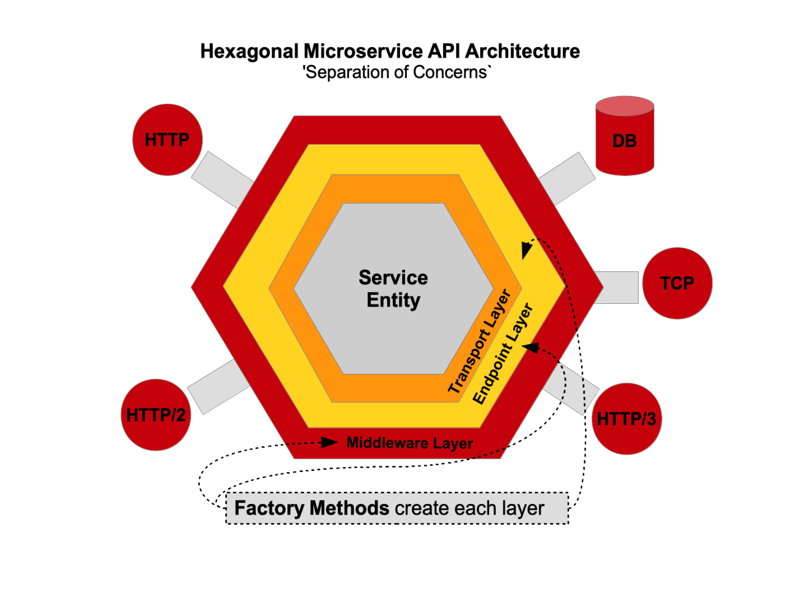
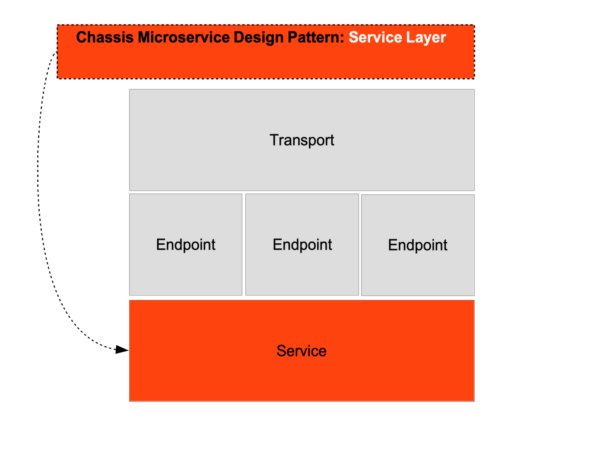
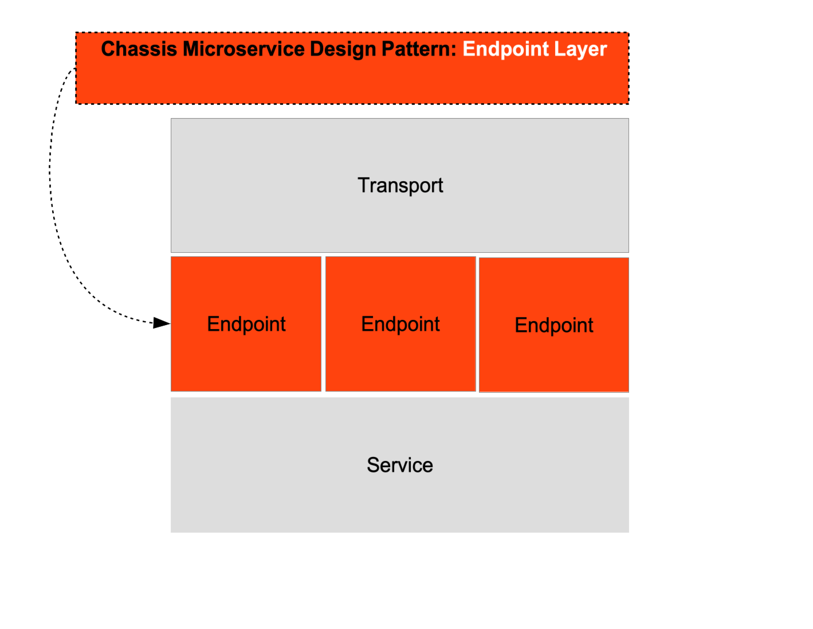
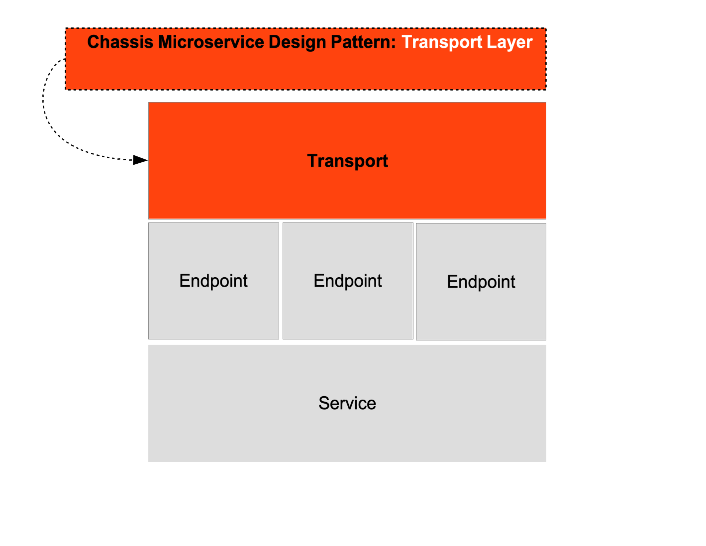
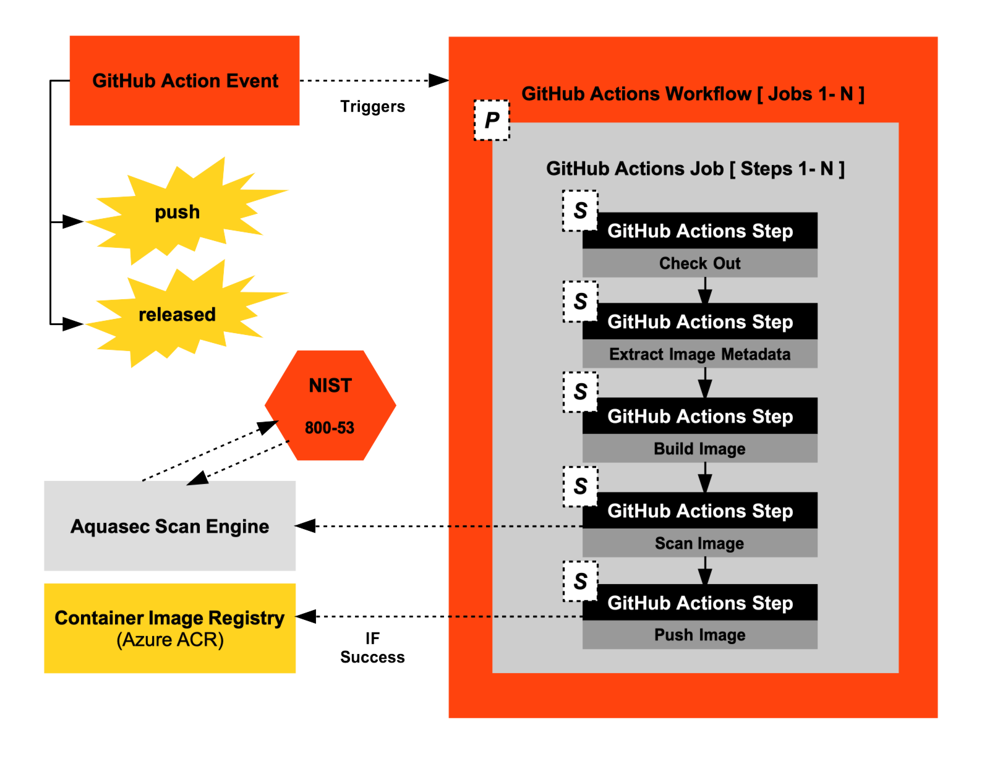

# GitHub Actions CI App Pipeline
The following Git repository contains a Go microserivice  and a Dockerfile as sources for a GitHub Actions workflow pipeline.

## K8s (Go) Web Service Reference App

This Go web service application serves as the app unit for the default K8s Helm Chart Guide Specs for all iEnergy applications. The Go web service provides two APIs:

- HTTP POST at endpoint `http://localhost:8080/engines/`
- HTTP GET at endpoint  `http://localhost:8080/engines/{id}`

The Go web service application serves Automotive engine classifications.
The Go web service **DOES NOT** reference SQL persistent storage (PostgreSQL) along with any TLS encrypted storage credentials for the engine payloads and currently references an in-memory dictionary cache. A future version will adapt a data repository service to hook in SQL storage. The `data` package in the project is a hook to this future addition.

## Architecture
The Go microservice uses the Go-kit Go Hexagonal Architecture API Toolkit to handle cross-cutting concerns each in a separate layer in the hexagon.




### Service


Services (Service Layer) is where the all of the core application logic resides. In Go-kit are defined as `Interfaces`. The `Service` layer does not deal with any of the other layers in the hexagon (`Endpoint` layer, `Transport` (HTTP/HTTPS REST, gRPC)layer, `Middleware` layer).
### Endpoint


Endpoints (Endpoint Layer) is where the action handlers on the controller. If there are two transports (HTTP REST, gRPC, GraphQL) defined for the Service, then there are two APIs sending requests to the exact Endpoint
### Transport


## Run the App

Prior to running the `gokit-enginesvc` app, it requires construction to an exe with the following approaches:

### Construct the Artifact (Non-Container without Docker):

Issue construction of the app with the provided `Makefile` as follows:
```
make compile
```

Now to run the app with the included web service engine listening on port `8080` issue the following:
```
./service
```

The exe artifact is deposited at the root of the project.


### Create/Register an automotive engine

```bash
$ curl -d '{"id":"00001","factory_id":"utc_pw_10-0001", "engine_config" : "Radial", "engine_capacity": 660.10, "fuel_capacity": 400.00, "fuel_range": 240.60}' -H "Content-Type: application/json" -X POST http://localhost:8080/engines/
{}
```

### Retrieve an automotive engine

```bash
$ curl localhost:8080/engines/00001
{"engine":{"id":"00001","factory_id":"utc_pw_10-0001", "engine_config" : "Radial", "engine_capacity": 660.10, "fuel_capacity": 400.00, "fuel_range": 240.60}}
```


### Construct the Artifact (Container with Docker):

To construct and run the app as a Docker container issue the following:

```
docker-compose up
```

Again as running the non-container version, issue the following HTTP POST and HTTP GET API requests:

### Create/Register an Automotive Engine (Running As Container)

```bash
$ curl -d '{"id":"00001","factory_id":"utc_pw_10-0001", "engine_config" : "Radial", "engine_capacity": 660.10, "fuel_capacity": 400.00, "fuel_range": 240.60}' -H "Content-Type: application/json" -X POST http://localhost:8080/engines/
{}
```

### Retrieve an Automotive Engine (Running as Container)

```bash
$ curl localhost:8080/engines/00001
{"engine":{"id":"00001","factory_id":"utc_pw_10-0001", "engine_config" : "Radial", "engine_capacity": 660.10, "fuel_capacity": 400.00, "fuel_range": 240.60}}
```


## GitHub Actions CI Workflow Pipeline

The following sections will cover the GitHub Actions workflow provided in the Git repo under the standard `github/workflows` directory. The following is covered in how the app code is constructed into a container image, how the container image is CVE scanned using `Aquasec` and how to fail the workflow if the container scan fails to avoid registering an infected container image into the container image registry. The CI for container image scanning prevents infected container images pulled into deployments in Kubernetes. 

The following is the standard GitHub Actions Workflow to push CVE scanned container images to a container image registry. The reference to `NIST 800-53` signifies the NIST regulations for containers and Kubernetes security adherence standards. The following reference to NIST 800-53 is provided `https://sysdig.com/blog/nist-800-53-compliance/`.



There are two provided GitHub Actions workflow CI pipelines included in this Gti repo.

- `.github/workflows/ci-nonprod.yml`
- `.github/workflows/ci-nonprod-scan-fail.yml`

### Container Image Scan Workflow No-Failure

The included `.github/workflows/ci-nonprod.yml` GitHub Actions CI workflow references a `1:1 association` with the included `Dockerfile`. This Dockerfile is a `Multi-Stage Dockerfile` for a Go microservice app. The root Dockerfile images are as follows.

- golang:1.18-alpine (Stage 1 of 2)
- alpine:latest (Stage 2 of 2)

Each of these two Docker container images are scanned recursively (a recursive descent into the root Docker image)starting with the developer Dockerfile instructions **AFTER** the declaration of the root image in the `Stage 1` header in the `FROM` instruction. The Dockerfile is defined as follows:

```
# stage 1
FROM golang:1.18-alpine as stage

WORKDIR /gokit-enginesvc
COPY go.mod go.sum ./
RUN go mod download
RUN go mod verify
# copy the source from the current directory to the Working Directory inside the container
#COPY . .
# The 'k8s' Kubernetes directory is NOT copied into the target image as it out of app code lifecycle
COPY client/ client/
COPY servicekit/ servicekit/
COPY cmd/service cmd/service/

ENV GO111MODULE=on
ENV CGO_ENABLED=0
ENV GOOS=linux
# the following line works if uncommented
#RUN go build k8s-reference-app/gokit-enginesvc/cmd/service
# the following line works
RUN go build -o service cmd/service/main.go


# stage 2
FROM alpine:latest
RUN apk add --no-cache git tzdata curl 
COPY --from=stage /etc/ssl/certs/ca-certificates.crt /etc/ssl/certs/
WORKDIR /root/
# copy ONLY the app ('service' exe) NOT the source from '/gokit-enginesvc'
COPY --from=stage /gokit-enginesvc/service .
# healthcheck
HEALTHCHECK CMD curl --fail http://localhost:8080/ || exit 1
CMD ["./service"]
```

### Container Image Scan Workflow Failure

The included `.github/workflows/ci-nonprod-scan-fail.yml` GitHub Actions CI workflow references a `1:1 association` with the included `Dockerfile.scan-fail`. This Dockerfile is a `Multi-Stage Dockerfile` for a Go microservice app. The root Dockerfile images are as follows.

- golang:1.14-alpine (Stage 1 of 2) as this `1.14` image version causes a CVE image scan failure
- alpine:latest (Stage 2 of 2)

Each of these two Docker container images are scanned recursively (a recursive descent into the root Docker image)starting with the developer Dockerfile instructions **AFTER** the declaration of the root image in the `Stage 1` header in the `FROM` instruction. The Dockerfile is defined as follows:

```
# stage 1
FROM golang:1.14-alpine as stage

WORKDIR /gokit-enginesvc
COPY go.mod go.sum ./
RUN go mod download
RUN go mod verify
# copy the source from the current directory to the Working Directory inside the container
#COPY . .
# The 'k8s' Kubernetes directory is NOT copied into the target image as it out of app code lifecycle
COPY client/ client/
COPY servicekit/ servicekit/
COPY cmd/service cmd/service/

ENV GO111MODULE=on
ENV CGO_ENABLED=0
ENV GOOS=linux
# the following line works if uncommented
#RUN go build k8s-reference-app/gokit-enginesvc/cmd/service
# the following line works
RUN go build -o service cmd/service/main.go


# stage 2
FROM golang:1.14-alpine -----------------------------> golang:1.14-alpine is known CVE
RUN apk add --no-cache git tzdata curl 
COPY --from=stage /etc/ssl/certs/ca-certificates.crt /etc/ssl/certs/
WORKDIR /root/
# copy ONLY the app ('service' exe) NOT the source from '/gokit-enginesvc'
COPY --from=stage /gokit-enginesvc/service .
# healthcheck
HEALTHCHECK CMD curl --fail http://localhost:8080/ || exit 1
CMD ["./service"]
```

### Analysis of a Failed Container Scan and Protocol to Resolve

The following GitHub Actions `.github/workflows/ci-nonprod-scan-fail.yml` execution at the stage of scanning the container image shows a series of CVEs `(Container Vulnernabilities and Errors)`.

```
2022-09-01T22:14:41.7623753Z ##[section]Starting: scan image with trivy
2022-09-01T22:14:41.7632992Z ==============================================================================
2022-09-01T22:14:41.7633304Z Task         : Bash
2022-09-01T22:14:41.7633547Z Description  : Run a Bash script on macOS, Linux, or Windows
2022-09-01T22:14:41.7633797Z Version      : 3.201.1
2022-09-01T22:14:41.7634005Z Author       : Microsoft Corporation
2022-09-01T22:14:41.7634323Z Help         : https://docs.microsoft.com/azure/devops/pipelines/tasks/utility/bash
2022-09-01T22:14:41.7634672Z ==============================================================================
2022-09-01T22:14:41.9103133Z Generating script.
2022-09-01T22:14:41.9128697Z ========================== Starting Command Output ===========================
2022-09-01T22:14:41.9144322Z [command]/usr/bin/bash /home/vsts/work/_temp/c0185024-3797-4aa6-a2e4-406f6a6cef54.sh
2022-09-01T22:14:42.4642664Z 2022-09-01T22:14:42.462Z	INFO	Need to update DB
2022-09-01T22:14:42.4643627Z 2022-09-01T22:14:42.462Z	INFO	DB Repository: ghcr.io/aquasecurity/trivy-db
2022-09-01T22:14:42.4644824Z 2022-09-01T22:14:42.462Z	INFO	Downloading DB...
2022-09-01T22:14:44.728Z	INFO	Vulnerability scanning is enabled
2022-09-01T22:14:44.7311790Z 2022-09-01T22:14:44.729Z	INFO	Secret scanning is enabled
2022-09-01T22:14:44.7312933Z 2022-09-01T22:14:44.729Z	INFO	If your scanning is slow, please try '--security-checks vuln' to disable secret scanning
2022-09-01T22:14:44.7313989Z 2022-09-01T22:14:44.729Z	INFO	Please see also https://aquasecurity.github.io/trivy/v0.31.2/docs/secret/scanning/#recommendation for faster secret detection
2022-09-01T22:14:51.6658588Z 2022-09-01T22:14:51.665Z	INFO	Detected OS: alpine
2022-09-01T22:14:51.6660290Z 2022-09-01T22:14:51.665Z	INFO	Detecting Alpine vulnerabilities...
2022-09-01T22:14:51.6685725Z 2022-09-01T22:14:51.668Z	INFO	Number of language-specific files: 1
2022-09-01T22:14:51.6687295Z 2022-09-01T22:14:51.668Z	INFO	Detecting gobinary vulnerabilities...
2022-09-01T22:14:51.6779237Z 
2022-09-01T22:14:51.6781154Z ***.azurecr.io/go-aquasec-scan-image:latest (alpine 3.13.1)
2022-09-01T22:14:51.6782064Z =========================================================================
2022-09-01T22:14:51.6782974Z Total: 12 (UNKNOWN: 0, LOW: 2, MEDIUM: 10)
2022-09-01T22:14:51.6783154Z 
2022-09-01T22:14:51.6784037Z ┌──────────────┬────────────────┬──────────┬───────────────────┬───────────────┬───────────────────────────────────────────────────────────┐
2022-09-01T22:14:51.6784857Z │   Library    │ Vulnerability  │ Severity │ Installed Version │ Fixed Version │                           Title                           │
2022-09-01T22:14:51.6785690Z ├──────────────┼────────────────┼──────────┼───────────────────┼───────────────┼───────────────────────────────────────────────────────────┤
2022-09-01T22:14:51.6786895Z │ busybox      │ CVE-2021-42374 │ MEDIUM   │ 1.32.1-r2         │ 1.32.1-r7     │ busybox: out-of-bounds read in unlzma applet leads to     │
2022-09-01T22:14:51.6787680Z │              │                │          │                   │               │ information leak and denial...                            │
2022-09-01T22:14:51.6788839Z │              │                │          │                   │               │ https://avd.aquasec.com/nvd/cve-2021-42374                │
2022-09-01T22:14:51.6789581Z │              ├────────────────┤          │                   │               ├───────────────────────────────────────────────────────────┤
2022-09-01T22:14:51.6790299Z │              │ CVE-2021-42375 │          │                   │               │ busybox: incorrect handling of a special element in ash   │
2022-09-01T22:14:51.6791035Z │              │                │          │                   │               │ applet leads to...                                        │
2022-09-01T22:14:51.6792154Z │              │                │          │                   │               │ https://avd.aquasec.com/nvd/cve-2021-42375                │
2022-09-01T22:14:51.6793150Z ├──────────────┼────────────────┤          ├───────────────────┼───────────────┼───────────────────────────────────────────────────────────┤
2022-09-01T22:14:51.6793912Z │ libcrypto1.1 │ CVE-2021-23841 │          │ 1.1.1i-r0         │ 1.1.1j-r0     │ openssl: NULL pointer dereference in                      │
2022-09-01T22:14:51.6794689Z │              │                │          │                   │               │ X509_issuer_and_serial_hash()                             │
2022-09-01T22:14:51.6795414Z │              │                │          │                   │               │ https://avd.aquasec.com/nvd/cve-2021-23841                │
2022-09-01T22:14:51.6796300Z │              ├────────────────┤          │                   ├───────────────┼───────────────────────────────────────────────────────────┤
2022-09-01T22:14:51.6797033Z │              │ CVE-2021-3449  │          │                   │ 1.1.1k-r0     │ openssl: NULL pointer dereference in signature_algorithms │
2022-09-01T22:14:51.6797728Z │              │                │          │                   │               │ processing                                                │
2022-09-01T22:14:51.6798415Z │              │                │          │                   │               │ https://avd.aquasec.com/nvd/cve-2021-3449                 │
2022-09-01T22:14:51.6799377Z │              ├────────────────┤          │                   ├───────────────┼───────────────────────────────────────────────────────────┤
2022-09-01T22:14:51.6800088Z │              │ CVE-2022-2097  │          │                   │ 1.1.1q-r0     │ openssl: AES OCB fails to encrypt some bytes              │
2022-09-01T22:14:51.6800853Z │              │                │          │                   │               │ https://avd.aquasec.com/nvd/cve-2022-2097                 │
2022-09-01T22:14:51.6801616Z │              ├────────────────┼──────────┤                   ├───────────────┼───────────────────────────────────────────────────────────┤
2022-09-01T22:14:51.6802741Z │              │ CVE-2021-23839 │ LOW      │                   │ 1.1.1j-r0     │ openssl: incorrect SSLv2 rollback protection              │
2022-09-01T22:14:51.6803689Z │              │                │          │                   │               │ https://avd.aquasec.com/nvd/cve-2021-23839                │
2022-09-01T22:14:51.6804450Z ├──────────────┼────────────────┼──────────┤                   │               ├───────────────────────────────────────────────────────────┤
2022-09-01T22:14:51.6805166Z │ libssl1.1    │ CVE-2021-23841 │ MEDIUM   │                   │               │ openssl: NULL pointer dereference in                      │
2022-09-01T22:14:51.6805924Z │              │                │          │                   │               │ X509_issuer_and_serial_hash()                             │
2022-09-01T22:14:51.6808902Z │              │                │          │                   │               │ https://avd.aquasec.com/nvd/cve-2021-23841                │
2022-09-01T22:14:51.6809802Z │              ├────────────────┤          │                   ├───────────────┼───────────────────────────────────────────────────────────┤
2022-09-01T22:14:51.6810616Z │              │ CVE-2021-3449  │          │                   │ 1.1.1k-r0     │ openssl: NULL pointer dereference in signature_algorithms │
2022-09-01T22:14:51.6811415Z │              │                │          │                   │               │ processing                                                │
2022-09-01T22:14:51.6812304Z │              │                │          │                   │               │ https://avd.aquasec.com/nvd/cve-2021-3449                 │
2022-09-01T22:14:51.6813824Z │              ├────────────────┤          │                   ├───────────────┼───────────────────────────────────────────────────────────┤
2022-09-01T22:14:51.6814989Z │              │ CVE-2022-2097  │          │                   │ 1.1.1q-r0     │ openssl: AES OCB fails to encrypt some bytes              │
2022-09-01T22:14:51.6815717Z │              │                │          │                   │               │ https://avd.aquasec.com/nvd/cve-2022-2097                 │
2022-09-01T22:14:51.6816463Z │              ├────────────────┼──────────┤                   ├───────────────┼───────────────────────────────────────────────────────────┤
2022-09-01T22:14:51.6817161Z │              │ CVE-2021-23839 │ LOW      │                   │ 1.1.1j-r0     │ openssl: incorrect SSLv2 rollback protection              │
2022-09-01T22:14:51.6818063Z │              │                │          │                   │               │ https://avd.aquasec.com/nvd/cve-2021-23839                │
2022-09-01T22:14:51.6818789Z ├──────────────┼────────────────┼──────────┼───────────────────┼───────────────┼───────────────────────────────────────────────────────────┤
2022-09-01T22:14:51.6819530Z │ ssl_client   │ CVE-2021-42374 │ MEDIUM   │ 1.32.1-r2         │ 1.32.1-r7     │ busybox: out-of-bounds read in unlzma applet leads to     │
2022-09-01T22:14:51.6820849Z │              │                │          │                   │               │ information leak and denial...                            │
2022-09-01T22:14:51.6821825Z │              │                │          │                   │               │ https://avd.aquasec.com/nvd/cve-2021-42374                │
2022-09-01T22:14:51.6822726Z │              ├────────────────┤          │                   │               ├───────────────────────────────────────────────────────────┤
2022-09-01T22:14:51.6823437Z │              │ CVE-2021-42375 │          │                   │               │ busybox: incorrect handling of a special element in ash   │
2022-09-01T22:14:51.6824358Z │              │                │          │                   │               │ applet leads to...                                        │
2022-09-01T22:14:51.6825270Z │              │                │          │                   │               │ https://avd.aquasec.com/nvd/cve-2021-42375                │
2022-09-01T22:14:51.6826206Z └──────────────┴────────────────┴──────────┴───────────────────┴───────────────┴───────────────────────────────────────────────────────────┘
2022-09-01T22:14:52.2671969Z 2022-09-01T22:14:52.265Z	INFO	Vulnerability scanning is enabled
2022-09-01T22:14:52.2673575Z 2022-09-01T22:14:52.265Z	INFO	Secret scanning is enabled
2022-09-01T22:14:52.2674921Z 2022-09-01T22:14:52.265Z	INFO	If your scanning is slow, please try '--security-checks vuln' to disable secret scanning
2022-09-01T22:14:52.2676501Z 2022-09-01T22:14:52.265Z	INFO	Please see also https://aquasecurity.github.io/trivy/v0.31.2/docs/secret/scanning/#recommendation for faster secret detection
2022-09-01T22:14:52.2720133Z 2022-09-01T22:14:52.271Z	INFO	Detected OS: alpine
2022-09-01T22:14:52.2721334Z 2022-09-01T22:14:52.271Z	INFO	Detecting Alpine vulnerabilities...
2022-09-01T22:14:52.2835385Z 2022-09-01T22:14:52.283Z	INFO	Number of language-specific files: 1
2022-09-01T22:14:52.2836671Z 2022-09-01T22:14:52.283Z	INFO	Detecting gobinary vulnerabilities...
2022-09-01T22:14:52.3160511Z 
2022-09-01T22:14:52.3163342Z ***.azurecr.io/go-aquasec-scan-image:latest (alpine 3.13.1)
2022-09-01T22:14:52.3165723Z =========================================================================
2022-09-01T22:14:52.3166882Z Total: 38 (HIGH: 34, CRITICAL: 4)
2022-09-01T22:14:52.3167327Z 
2022-09-01T22:14:52.3169234Z ┌──────────────┬────────────────┬──────────┬───────────────────┬───────────────┬─────────────────────────────────────────────────────────────┐
2022-09-01T22:14:52.3170107Z │   Library    │ Vulnerability  │ Severity │ Installed Version │ Fixed Version │                            Title                            │
2022-09-01T22:14:52.3170965Z ├──────────────┼────────────────┼──────────┼───────────────────┼───────────────┼─────────────────────────────────────────────────────────────┤
2022-09-01T22:14:52.3171757Z │ apk-tools    │ CVE-2021-36159 │ CRITICAL │ 2.12.1-r0         │ 2.12.6-r0     │ libfetch before 2021-07-26, as used in apk-tools, xbps, and │
2022-09-01T22:14:52.3173676Z │              │                │          │                   │               │ other products, mishandles...                               │
2022-09-01T22:14:52.3174378Z │              │                │          │                   │               │ https://avd.aquasec.com/nvd/cve-2021-36159                  │
2022-09-01T22:14:52.3175087Z │              ├────────────────┼──────────┤                   ├───────────────┼─────────────────────────────────────────────────────────────┤
2022-09-01T22:14:52.3176101Z │              │ CVE-2021-30139 │ HIGH     │                   │ 2.12.5-r0     │ In Alpine Linux apk-tools before 2.12.5, the tarball parser │
2022-09-01T22:14:52.3176773Z │              │                │          │                   │               │ allows a buffer...                                          │
2022-09-01T22:14:52.3177644Z │              │                │          │                   │               │ https://avd.aquasec.com/nvd/cve-2021-30139                  │
2022-09-01T22:14:52.3178350Z ├──────────────┼────────────────┤          ├───────────────────┼───────────────┼─────────────────────────────────────────────────────────────┤
2022-09-01T22:14:52.3179022Z │ busybox      │ CVE-2021-28831 │          │ 1.32.1-r2         │ 1.32.1-r4     │ busybox: invalid free or segmentation fault via malformed   │
2022-09-01T22:14:52.3179690Z │              │                │          │                   │               │ gzip data                                                   │
2022-09-01T22:14:52.3180457Z │              │                │          │                   │               │ https://avd.aquasec.com/nvd/cve-2021-28831                  │
2022-09-01T22:14:52.3181095Z │              ├────────────────┤          │                   ├───────────────┼─────────────────────────────────────────────────────────────┤
2022-09-01T22:14:52.3181749Z │              │ CVE-2021-42378 │          │                   │ 1.32.1-r7     │ busybox: use-after-free in awk applet leads to denial of    │
2022-09-01T22:14:52.3182798Z │              │                │          │                   │               │ service and possibly...                                     │
2022-09-01T22:14:52.3183446Z │              │                │          │                   │               │ https://avd.aquasec.com/nvd/cve-2021-42378                  │
2022-09-01T22:14:52.3184112Z │              ├────────────────┤          │                   │               ├─────────────────────────────────────────────────────────────┤
2022-09-01T22:14:52.3184760Z │              │ CVE-2021-42379 │          │                   │               │ busybox: use-after-free in awk applet leads to denial of    │
2022-09-01T22:14:52.3185586Z │              │                │          │                   │               │ service and possibly...                                     │
2022-09-01T22:14:52.3186528Z │              │                │          │                   │               │ https://avd.aquasec.com/nvd/cve-2021-42379                  │
2022-09-01T22:14:52.3187306Z │              ├────────────────┤          │                   │               ├─────────────────────────────────────────────────────────────┤
2022-09-01T22:14:52.3187929Z │              │ CVE-2021-42380 │          │                   │               │ busybox: use-after-free in awk applet leads to denial of    │
2022-09-01T22:14:52.3188561Z │              │                │          │                   │               │ service and possibly...                                     │
2022-09-01T22:14:52.3189169Z │              │                │          │                   │               │ https://avd.aquasec.com/nvd/cve-2021-42380                  │
2022-09-01T22:14:52.3189797Z │              ├────────────────┤          │                   │               ├─────────────────────────────────────────────────────────────┤
2022-09-01T22:14:52.3190622Z │              │ CVE-2021-42381 │          │                   │               │ busybox: use-after-free in awk applet leads to denial of    │
2022-09-01T22:14:52.3191289Z │              │                │          │                   │               │ service and possibly...                                     │
2022-09-01T22:14:52.3191910Z │              │                │          │                   │               │ https://avd.aquasec.com/nvd/cve-2021-42381                  │
2022-09-01T22:14:52.3192923Z │              ├────────────────┤          │                   │               ├─────────────────────────────────────────────────────────────┤
2022-09-01T22:14:52.3193590Z │              │ CVE-2021-42382 │          │                   │               │ busybox: use-after-free in awk applet leads to denial of    │
2022-09-01T22:14:52.3194279Z │              │                │          │                   │               │ service and possibly...                                     │
2022-09-01T22:14:52.3194972Z │              │                │          │                   │               │ https://avd.aquasec.com/nvd/cve-2021-42382                  │
2022-09-01T22:14:52.3195828Z │              ├────────────────┤          │                   │               ├─────────────────────────────────────────────────────────────┤
2022-09-01T22:14:52.3196770Z │              │ CVE-2021-42383 │          │                   │               │ busybox: use-after-free in awk applet leads to denial of    │
2022-09-01T22:14:52.3197401Z │              │                │          │                   │               │ service and possibly...                                     │
2022-09-01T22:14:52.3198007Z │              │                │          │                   │               │ https://avd.aquasec.com/nvd/cve-2021-42383                  │
2022-09-01T22:14:52.3198632Z │              ├────────────────┤          │                   │               ├─────────────────────────────────────────────────────────────┤
2022-09-01T22:14:52.3199269Z │              │ CVE-2021-42384 │          │                   │               │ busybox: use-after-free in awk applet leads to denial of    │
2022-09-01T22:14:52.3200050Z │              │                │          │                   │               │ service and possibly...                                     │
2022-09-01T22:14:52.3200688Z │              │                │          │                   │               │ https://avd.aquasec.com/nvd/cve-2021-42384                  │
2022-09-01T22:14:52.3201312Z │              ├────────────────┤          │                   │               ├─────────────────────────────────────────────────────────────┤
2022-09-01T22:14:52.3201921Z │              │ CVE-2021-42385 │          │                   │               │ busybox: use-after-free in awk applet leads to denial of    │
2022-09-01T22:14:52.3202923Z │              │                │          │                   │               │ service and possibly...                                     │
2022-09-01T22:14:52.3203740Z │              │                │          │                   │               │ https://avd.aquasec.com/nvd/cve-2021-42385                  │
2022-09-01T22:14:52.3204609Z │              ├────────────────┤          │                   │               ├─────────────────────────────────────────────────────────────┤
2022-09-01T22:14:52.3205282Z │              │ CVE-2021-42386 │          │                   │               │ busybox: use-after-free in awk applet leads to denial of    │
2022-09-01T22:14:52.3206365Z │              │                │          │                   │               │ service and possibly...                                     │
2022-09-01T22:14:52.3206991Z │              │                │          │                   │               │ https://avd.aquasec.com/nvd/cve-2021-42386                  │
2022-09-01T22:14:52.3207646Z │              ├────────────────┤          │                   ├───────────────┼─────────────────────────────────────────────────────────────┤
2022-09-01T22:14:52.3208302Z │              │ CVE-2022-28391 │          │                   │ 1.32.1-r8     │ busybox: remote attackers may execute arbitrary code if     │
2022-09-01T22:14:52.3208981Z │              │                │          │                   │               │ netstat is used                                             │
2022-09-01T22:14:52.3209757Z │              │                │          │                   │               │ https://avd.aquasec.com/nvd/cve-2022-28391                  │
2022-09-01T22:14:52.3210422Z │              ├────────────────┤          │                   ├───────────────┼─────────────────────────────────────────────────────────────┤
2022-09-01T22:14:52.3211051Z │              │ CVE-2022-30065 │          │                   │ 1.32.1-r9     │ busybox: A use-after-free in Busybox's awk applet leads to  │
2022-09-01T22:14:52.3211692Z │              │                │          │                   │               │ denial of service...                                        │
2022-09-01T22:14:52.3252951Z │              │                │          │                   │               │ https://avd.aquasec.com/nvd/cve-2022-30065                  │
2022-09-01T22:14:52.3254233Z ├──────────────┼────────────────┼──────────┼───────────────────┼───────────────┼─────────────────────────────────────────────────────────────┤
2022-09-01T22:14:52.3254977Z │ libcrypto1.1 │ CVE-2021-3711  │ CRITICAL │ 1.1.1i-r0         │ 1.1.1l-r0     │ openssl: SM2 Decryption Buffer Overflow                     │
2022-09-01T22:14:52.3256046Z │              │                │          │                   │               │ https://avd.aquasec.com/nvd/cve-2021-3711                   │
2022-09-01T22:14:52.3256692Z │              ├────────────────┼──────────┤                   ├───────────────┼─────────────────────────────────────────────────────────────┤
2022-09-01T22:14:52.3257312Z │              │ CVE-2021-23840 │ HIGH     │                   │ 1.1.1j-r0     │ openssl: integer overflow in CipherUpdate                   │
2022-09-01T22:14:52.3258200Z │              │                │          │                   │               │ https://avd.aquasec.com/nvd/cve-2021-23840                  │
2022-09-01T22:14:52.3258888Z │              ├────────────────┤          │                   ├───────────────┼─────────────────────────────────────────────────────────────┤
2022-09-01T22:14:52.3259499Z │              │ CVE-2021-3450  │          │                   │ 1.1.1k-r0     │ openssl: CA certificate check bypass with                   │
2022-09-01T22:14:52.3260323Z │              │                │          │                   │               │ X509_V_FLAG_X509_STRICT                                     │
2022-09-01T22:14:52.3260952Z │              │                │          │                   │               │ https://avd.aquasec.com/nvd/cve-2021-3450                   │
2022-09-01T22:14:52.3261634Z │              ├────────────────┤          │                   ├───────────────┼─────────────────────────────────────────────────────────────┤
2022-09-01T22:14:52.3262441Z │              │ CVE-2021-3712  │          │                   │ 1.1.1l-r0     │ openssl: Read buffer overruns processing ASN.1 strings      │
2022-09-01T22:14:52.3263432Z │              │                │          │                   │               │ https://avd.aquasec.com/nvd/cve-2021-3712                   │
2022-09-01T22:14:52.3264126Z │              ├────────────────┤          │                   ├───────────────┼─────────────────────────────────────────────────────────────┤
2022-09-01T22:14:52.3266660Z │              │ CVE-2022-0778  │          │                   │ 1.1.1n-r0     │ openssl: Infinite loop in BN_mod_sqrt() reachable when      │
2022-09-01T22:14:52.3267688Z │              │                │          │                   │               │ parsing certificates                                        │
2022-09-01T22:14:52.3268782Z │              │                │          │                   │               │ https://avd.aquasec.com/nvd/cve-2022-0778                   │
2022-09-01T22:14:52.3269594Z ├──────────────┼────────────────┼──────────┤                   ├───────────────┼─────────────────────────────────────────────────────────────┤
2022-09-01T22:14:52.3274520Z │ libssl1.1    │ CVE-2021-3711  │ CRITICAL │                   │ 1.1.1l-r0     │ openssl: SM2 Decryption Buffer Overflow                     │
2022-09-01T22:14:52.3275273Z │              │                │          │                   │               │ https://avd.aquasec.com/nvd/cve-2021-3711                   │
2022-09-01T22:14:52.3276265Z │              ├────────────────┼──────────┤                   ├───────────────┼─────────────────────────────────────────────────────────────┤
2022-09-01T22:14:52.3276884Z │              │ CVE-2021-23840 │ HIGH     │                   │ 1.1.1j-r0     │ openssl: integer overflow in CipherUpdate                   │
2022-09-01T22:14:52.3277765Z │              │                │          │                   │               │ https://avd.aquasec.com/nvd/cve-2021-23840                  │
2022-09-01T22:14:52.3278408Z │              ├────────────────┤          │                   ├───────────────┼─────────────────────────────────────────────────────────────┤
2022-09-01T22:14:52.3279440Z │              │ CVE-2021-3450  │          │                   │ 1.1.1k-r0     │ openssl: CA certificate check bypass with                   │
2022-09-01T22:14:52.3280185Z │              │                │          │                   │               │ X509_V_FLAG_X509_STRICT                                     │
2022-09-01T22:14:52.3280891Z │              │                │          │                   │               │ https://avd.aquasec.com/nvd/cve-2021-3450                   │
2022-09-01T22:14:52.3281634Z │              ├────────────────┤          │                   ├───────────────┼─────────────────────────────────────────────────────────────┤
2022-09-01T22:14:52.3282729Z │              │ CVE-2021-3712  │          │                   │ 1.1.1l-r0     │ openssl: Read buffer overruns processing ASN.1 strings      │
2022-09-01T22:14:52.3284094Z │              │                │          │                   │               │ https://avd.aquasec.com/nvd/cve-2021-3712                   │
2022-09-01T22:14:52.3285064Z │              ├────────────────┤          │                   ├───────────────┼─────────────────────────────────────────────────────────────┤
2022-09-01T22:14:52.3286137Z │              │ CVE-2022-0778  │          │                   │ 1.1.1n-r0     │ openssl: Infinite loop in BN_mod_sqrt() reachable when      │
2022-09-01T22:14:52.3287164Z │              │                │          │                   │               │ parsing certificates                                        │
2022-09-01T22:14:52.3287803Z │              │                │          │                   │               │ https://avd.aquasec.com/nvd/cve-2022-0778                   │
2022-09-01T22:14:52.3288663Z ├──────────────┼────────────────┤          ├───────────────────┼───────────────┼─────────────────────────────────────────────────────────────┤
2022-09-01T22:14:52.3289400Z │ ssl_client   │ CVE-2021-28831 │          │ 1.32.1-r2         │ 1.32.1-r4     │ busybox: invalid free or segmentation fault via malformed   │
2022-09-01T22:14:52.3290294Z │              │                │          │                   │               │ gzip data                                                   │
2022-09-01T22:14:52.3341789Z │              │                │          │                   │               │ https://avd.aquasec.com/nvd/cve-2021-28831                  │
2022-09-01T22:14:52.3342987Z │              ├────────────────┤          │                   ├───────────────┼─────────────────────────────────────────────────────────────┤
2022-09-01T22:14:52.3343681Z │              │ CVE-2021-42378 │          │                   │ 1.32.1-r7     │ busybox: use-after-free in awk applet leads to denial of    │
2022-09-01T22:14:52.3344408Z │              │                │          │                   │               │ service and possibly...                                     │
2022-09-01T22:14:52.3345039Z │              │                │          │                   │               │ https://avd.aquasec.com/nvd/cve-2021-42378                  │
2022-09-01T22:14:52.3345732Z │              ├────────────────┤          │                   │               ├─────────────────────────────────────────────────────────────┤
2022-09-01T22:14:52.3346683Z │              │ CVE-2021-42379 │          │                   │               │ busybox: use-after-free in awk applet leads to denial of    │
2022-09-01T22:14:52.3347313Z │              │                │          │                   │               │ service and possibly...                                     │
2022-09-01T22:14:52.3347927Z │              │                │          │                   │               │ https://avd.aquasec.com/nvd/cve-2021-42379                  │
2022-09-01T22:14:52.3348573Z │              ├────────────────┤          │                   │               ├─────────────────────────────────────────────────────────────┤
2022-09-01T22:14:52.3349168Z │              │ CVE-2021-42380 │          │                   │               │ busybox: use-after-free in awk applet leads to denial of    │
2022-09-01T22:14:52.3350071Z │              │                │          │                   │               │ service and possibly...                                     │
2022-09-01T22:14:52.3350692Z │              │                │          │                   │               │ https://avd.aquasec.com/nvd/cve-2021-42380                  │
2022-09-01T22:14:52.3351513Z │              ├────────────────┤          │                   │               ├─────────────────────────────────────────────────────────────┤
2022-09-01T22:14:52.3352377Z │              │ CVE-2021-42381 │          │                   │               │ busybox: use-after-free in awk applet leads to denial of    │
2022-09-01T22:14:52.3353481Z │              │                │          │                   │               │ service and possibly...                                     │
2022-09-01T22:14:52.3354136Z │              │                │          │                   │               │ https://avd.aquasec.com/nvd/cve-2021-42381                  │
2022-09-01T22:14:52.3354841Z │              ├────────────────┤          │                   │               ├─────────────────────────────────────────────────────────────┤
2022-09-01T22:14:52.3355508Z │              │ CVE-2021-42382 │          │                   │               │ busybox: use-after-free in awk applet leads to denial of    │
2022-09-01T22:14:52.3356773Z │              │                │          │                   │               │ service and possibly...                                     │
2022-09-01T22:14:52.3357601Z │              │                │          │                   │               │ https://avd.aquasec.com/nvd/cve-2021-42382                  │
2022-09-01T22:14:52.3358308Z │              ├────────────────┤          │                   │               ├─────────────────────────────────────────────────────────────┤
2022-09-01T22:14:52.3359297Z │              │ CVE-2021-42383 │          │                   │               │ busybox: use-after-free in awk applet leads to denial of    │
2022-09-01T22:14:52.3360008Z │              │                │          │                   │               │ service and possibly...                                     │
2022-09-01T22:14:52.3360671Z │              │                │          │                   │               │ https://avd.aquasec.com/nvd/cve-2021-42383                  │
2022-09-01T22:14:52.3361711Z │              ├────────────────┤          │                   │               ├─────────────────────────────────────────────────────────────┤
2022-09-01T22:14:52.3362565Z │              │ CVE-2021-42384 │          │                   │               │ busybox: use-after-free in awk applet leads to denial of    │
2022-09-01T22:14:52.3363504Z │              │                │          │                   │               │ service and possibly...                                     │
2022-09-01T22:14:52.3364505Z │              │                │          │                   │               │ https://avd.aquasec.com/nvd/cve-2021-42384                  │
2022-09-01T22:14:52.3366637Z │              ├────────────────┤          │                   │               ├─────────────────────────────────────────────────────────────┤
2022-09-01T22:14:52.3367665Z │              │ CVE-2021-42385 │          │                   │               │ busybox: use-after-free in awk applet leads to denial of    │
2022-09-01T22:14:52.3368476Z │              │                │          │                   │               │ service and possibly...                                     │
2022-09-01T22:14:52.3369395Z │              │                │          │                   │               │ https://avd.aquasec.com/nvd/cve-2021-42385                  │
2022-09-01T22:14:52.3370458Z │              ├────────────────┤          │                   │               ├─────────────────────────────────────────────────────────────┤
2022-09-01T22:14:52.3371101Z │              │ CVE-2021-42386 │          │                   │               │ busybox: use-after-free in awk applet leads to denial of    │
2022-09-01T22:14:52.3371751Z │              │                │          │                   │               │ service and possibly...                                     │
2022-09-01T22:14:52.3373216Z │              │                │          │                   │               │ https://avd.aquasec.com/nvd/cve-2021-42386                  │
2022-09-01T22:14:52.3376318Z │              ├────────────────┤          │                   ├───────────────┼─────────────────────────────────────────────────────────────┤
2022-09-01T22:14:52.3377207Z │              │ CVE-2022-28391 │          │                   │ 1.32.1-r8     │ busybox: remote attackers may execute arbitrary code if     │
2022-09-01T22:14:52.3377881Z │              │                │          │                   │               │ netstat is used                                             │
2022-09-01T22:14:52.3378484Z │              │                │          │                   │               │ https://avd.aquasec.com/nvd/cve-2022-28391                  │
2022-09-01T22:14:52.3379128Z │              ├────────────────┤          │                   ├───────────────┼─────────────────────────────────────────────────────────────┤
2022-09-01T22:14:52.3380127Z │              │ CVE-2022-30065 │          │                   │ 1.32.1-r9     │ busybox: A use-after-free in Busybox's awk applet leads to  │
2022-09-01T22:14:52.3391797Z │              │                │          │                   │               │ denial of service...                                        │
2022-09-01T22:14:52.3392480Z │              │                │          │                   │               │ https://avd.aquasec.com/nvd/cve-2022-30065                  │
2022-09-01T22:14:52.3393490Z ├──────────────┼────────────────┼──────────┼───────────────────┼───────────────┼─────────────────────────────────────────────────────────────┤
2022-09-01T22:14:52.3395437Z │ zlib         │ CVE-2022-37434 │ CRITICAL │ 1.2.11-r3         │ 1.2.12-r2     │ zlib: a heap-based buffer over-read or buffer overflow in   │
2022-09-01T22:14:52.3396589Z │              │                │          │                   │               │ inflate in inflate.c...                                     │
2022-09-01T22:14:52.3397188Z │              │                │          │                   │               │ https://avd.aquasec.com/nvd/cve-2022-37434                  │
2022-09-01T22:14:52.3397836Z │              ├────────────────┼──────────┤                   ├───────────────┼─────────────────────────────────────────────────────────────┤
2022-09-01T22:14:52.3398462Z │              │ CVE-2018-25032 │ HIGH     │                   │ 1.2.12-r0     │ zlib: A flaw found in zlib when compressing (not            │
2022-09-01T22:14:52.3399332Z │              │                │          │                   │               │ decompressing) certain inputs...                            │
2022-09-01T22:14:52.3399977Z │              │                │          │                   │               │ https://avd.aquasec.com/nvd/cve-2018-25032                  │
2022-09-01T22:14:52.3400636Z └──────────────┴────────────────┴──────────┴───────────────────┴───────────────┴─────────────────────────────────────────────────────────────┘
2022-09-01T22:14:52.3433316Z ##[error]Bash exited with code '1'.
2022-09-01T22:14:52.3449332Z ##[section]Finishing: scan image with trivy
```

The preceding CVE scan failure shows a results matrix and shows fixes to resolve. See the `Fixed Version` section.


### GitHub Actions Jobs

GitHub Actions `Jobs` are executed in-parallel with other Jobs and are NOT executed sequentially. A `Job` is executed within a GitHub host-provided runner or as Non-GitHub self-hosted runner. Non-GitHub self-hosted runners offer increased control over where the runner will execute the CI workflow. These self-hosted runners can also execute the CI workflows directly on K8s clusters. This direct on K8s clusters configuration is detailed in the last section of this README. A GitHub Actions `Job` is the root handle to the individual sequentially executed workflow tasks called `Steps`. A Job is a collection of `Steps`. 

The Jobs are their own require a trigger to start. Jobs are triggered through GitHub Action `Events`. In the included `.github/workflowd/ci-nonprod.yaml`, the events of interest to build a container image from app code and its provided Dockerfile are `push` and `release`. To declare the trigger on these two events the syntax is as follows:

```
on:
  push:
    branches: [ main ]
  release:
    types: [ published ]
```

Any Git pushes on the `main` branch in the previous GitHub Action Workflow will trigger the CI workflow.

The entire GitHub Actions `Events` list is here: `https://docs.github.com/en/actions/using-workflows/events-that-trigger-workflows`.


### GitHub Actions Jobs vs Azure DevOps Pipeline Jobs

GitHub Actions Jobs equivalent in Azure DevOps Pipelines is also a `Job`. Azure DevOps Pipelines have a preceding layer called a `Stage` and a Stage is a collection of `Jobs`. GitHub Actions DO NOT have a `Stage` layer. The root of the GitHub Actions workflow is name of the workflow as follows.

Refer to `.github/workflows/ci-nonprod.yml`

```
name: CI Container Image Workflow

permissions:
  contents: read
  packages: write
  id-token: write 
  security-events: write

on:
  push:
    branches: [ main ]
  release:
    types: [ published ]

jobs:

   build:
   runs-on: ubuntu-latest

   steps:
   ....

```

In the preceding section of the GitHub Actions workflow, the root of the workflow is the `name: CI Container Image Workflow`.
In the root level of this workflow there are configuration args that are applied throughout the scope of the workflow steps within the `Job`.

In `Azure DevOps Pipelines` in a Git repository, at the root-level directory, the `azure-pipelines.yaml` file translates the preceding GitHub Actions section looks as follows.

```
trigger:
- main

resources:
  - repo: self

stages:
  - stage: build
    displayName: Build and Push Container Image Pipeline
    jobs:
    - job: build 
      displayName: Build and Push Container Image
      pool:
        name: Container Image Push Azure Pipelines
        vmimage: `'ubuntu-latest'
      steps:
      ...

```
As seen, the differences are few. 

### GitHub Actions Steps

The following is the entire GitHub Action workflow in `github/workflows/ci-nonprod.yml`. After the entire code is listed, a step-for-step distillation of each step will follow. 

```
name: CI Container Image Workflow

on:
  push:
    branches: [ main ]
  release:
    types: [ published ]

jobs:

    build:
      if: "!contains(github.event.head_commit.message, 'skip ci')"
      runs-on: ubuntu-latest

      steps:
        - name: Check Out
          uses: actions/checkout@v3

        - name: Log in to Docker Hub
          uses: docker/login-action@f054a8b539a109f9f41c372932f1ae047eff08c9
          with:
            username: ${{ secrets.DOCKER_USERNAME }}
            password: ${{ secrets.DOCKER_PASSWORD }}


        - name: Extract Metadata (Tags, Labels) for Docker
          id: meta
          uses: docker/metadata-action@98669ae865ea3cffbcbaa878cf57c20bbf1c6c38
          with:
            images: isgogolgo13/gokit-engine-svc

        - name: Build Image
          uses: docker/build-push-action@v2
          with:
            tags: ${{ steps.docker_meta.outputs.tags }}
            file: ./Dockerfile

        - name: CVE Scan Image
          uses: aquasecurity/trivy-action@master
          with:
            image-ref: 'docker.io/isgogolgo13/gokit-engine-svc:${{ steps.docker_meta.outputs.tags }}'
            format: 'table'
            exit-code: '1'
            ignore-unfixed: true
            vuln-type: 'os,library'
            severity: 'CRITICAL,HIGH'

        - name: Push Image
          uses: docker/build-push-action@ad44023a93711e3deb337508980b4b5e9bcdc5dc
          with:
            #context: .
            push: true
            tags: ${{ steps.meta.outputs.tags }}
            labels: ${{ steps.meta.outputs.labels }}

```
The GitHub Action `Steps` in the previous code are as follows:

- Check Out
- Login DockerHub (DockerHub, Azure ACR or other privately configured container registry)
- Extract Docker Image Meta-Data (container image tags)
- Build Container Image
- Scan Container Image
- Push Container Image (IF step `Scan Container Image` passes)


### GitHub Actions CVE (Container Vulnerability Error) Scanning Engines
The Git repository uses two CVE NIST 800-53 level container image scanning engines as a reference. The CVE engines used with each CVE engine provided in the included `.github/workflows` directory are the following.

- CVE Engine Container Image Scanner `Aquasec Trivy`
- CVE Engine Container Image Scanner `Synk`

The included GitHub Actions Pipelines are.

- .github/workflows/ci-nonprod-aquasec-cve-scan-fail.yml 
  - This container image scan pipeline force fails on corrupted image provided with Aquasec

- .github/workflows/ci-nonprod-aquasec-cve-scan.yml
  - This container image scan pipeline passes the image provided with Aquasec

- .github/workflows/ci-nonprod-snyk-cve-scan.yml
  - This container image scan pipeline passses the image provided with Snyk


Looking at Aquasec and Snyk container scan task the differences are next to none.

The `.github/workflows/ci-nonprod-snyk-cve-scan.yml` is as follows.

```
        - name: CVE Scan Image using Snyk CVE Engine
          uses: snyk/actions/docker@master
          env:
            SNYK_TOKEN: ${{ secrets.SNYK_TOKEN }}
          with:
            image: 'docker.io/isgogolgo13/gokit-engine-svc:main'
            args: --severity-threshold=high
```

The part that will change for any app team requiring the scanning of their own container images is the following section from the previous code.

```
      ...
          with:
            image: 'app/app-image-to-scan'    # odpcorp/app-image:{tag}
      ...
```

The GitHub Actions Workflow will require a configuration of environments variable credentials to access the container image registry.
Present in all of the GitHub Actions Workflows is a task-action that logs into the container registry to allow the workflow pipeline to push the container image if and only if the container image passes the CVE scan.

The following GitHub secrets `secrets.DOCKER_USERNAME` and `secrets.DOCKER_PASSWORD` you will require changing for your own GitHub repository and update this in your GitHub Actions Workflows. The container image repositories can be a private hosted Docker container registry, a private hosted Docker container registry in K8s cluster as a StatefulSet Pod or a cloud offered container registry suchn as Azure ACR. This GitHub repo uses a private developer DockerHub registry for this PoC. You will require changing your credentials to point to your container registry.

```
        - name: Log in to Docker Hub
          uses: docker/login-action@f054a8b539a109f9f41c372932f1ae047eff08c9
          with:
            username: ${{ secrets.DOCKER_USERNAME }}
            password: ${{ secrets.DOCKER_PASSWORD }}
```

To configure the environment variables for GitHub secrets go to the root of the GitHub repo and click link `Settings`, then click link `Actions` under `Secrets and Variables`. The secrets to configure are in `Repository Secrets`. After the secrets to your container registry are configured you will require changing the previous listed code for `username` and `password` and pass in your configured secrets environments variables.


### GitHub Actions GitHub Hosted Runners

GitHub, as a default, provides their cloud servers to execute GitHub Actions workflows. The use rate of GitHub Actions `Jobs` executed on their servers is dependent on the tier-offering signed to. The GitHub Actions cloud servers offer the following OS versions.

- Ubuntu Server Latest or `ubuntu-22.04`
- Ubuntu Server `ubuntu-20.04`
- Windows Server 2022 `windows-2022`
- Windows Server 2022 `windows-2019`

### GitHub Actions Self-Hosted Runners

GitHub allows for clients to provide own self-hosted servers to execute the GitHub Actions workflows. In the latest design strategy offerings, the self-hosting is executed on Kubernetes clusters. This is done with the K8s GitHub Actions Self-Hosted Operator.


## Advantages of GitHub Actions 

- GitHub Actions DO NOT require third-party plugin updates
- GitHub Actions are natively associated with Git and GitHub
- GitHub Actions hosted-runners are hosted on GitHub Cloud with NO extra configuration 
- GitHub Actions offers self-hosted K8s runners with GitHub Self-Hosted K8s Operator (Helm Chart)
- GitHub Actions are asynchronous and offer superior scaling execution

